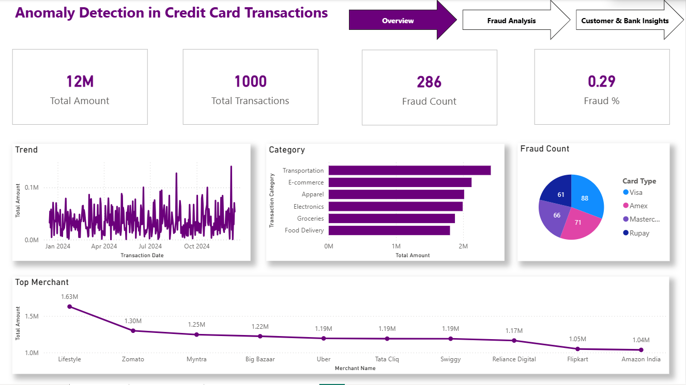
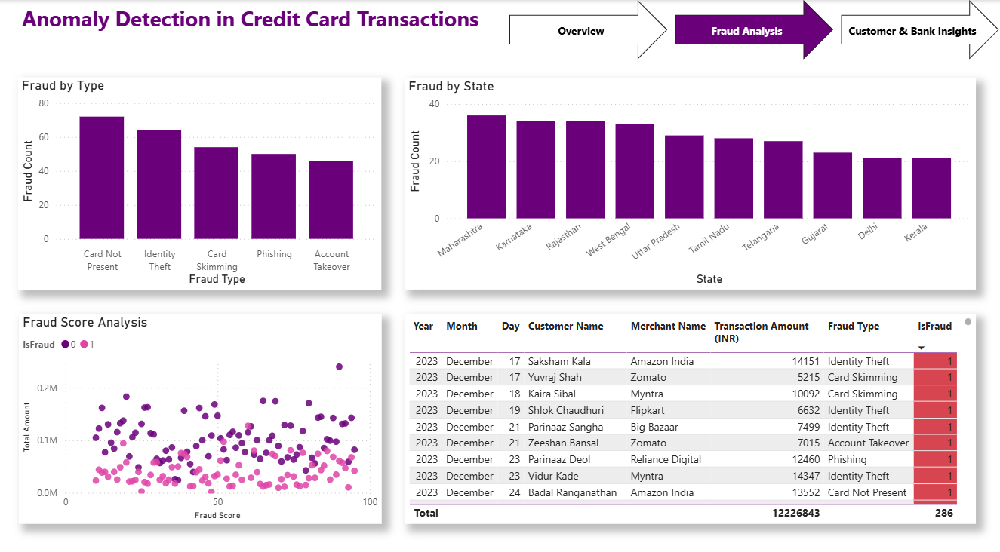
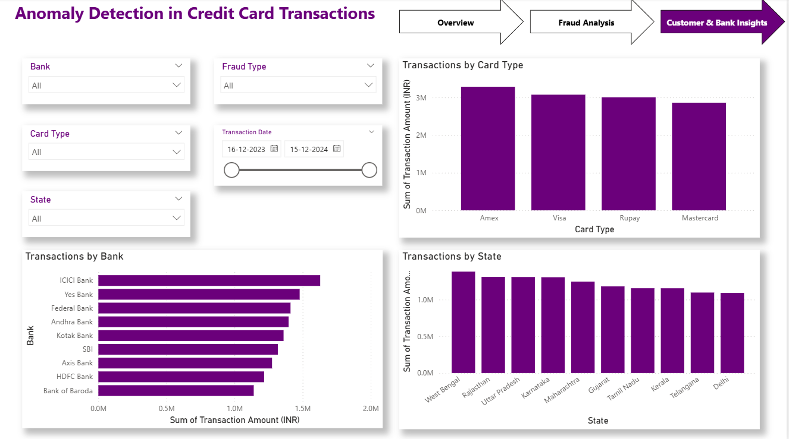

# 💳 Anomaly Detection in Credit Card Transactions

## 🚀 Project Overview
This project presents an interactive **Credit Card Fraud Detection Dashboard** built using Power BI.  
It analyzes transaction patterns to identify anomalies and detect fraudulent activities across banks, states, and transaction types.

---

## 📌 Key Metrics
- 💰 Total Transaction Amount: 12M  
- 📊 Total Transactions: 1000  
- 🚨 Fraud Count: 286  
- 📉 Fraud Percentage: 0.29  

---

## 📷 Dashboard Preview
### 🔹 Overview

### 🔹 Fraud Analysis

### 🔹 Customer & Bank Insights

---

## 📊 Features
- 🏦 Bank-wise transaction analysis  
- 💳 Card type analysis (Visa, Amex, Mastercard, Rupay)  
- 🌍 State-wise transaction and fraud distribution  
- ⚠️ Fraud type classification (Identity Theft, Phishing, Skimming, etc.)  
- 📈 Transaction trends over time  
- 🎯 Fraud score analysis (anomaly detection)  
- 🛍️ Merchant-level insights  
- 🔍 Interactive filters (Bank, Card Type, Fraud Type, Date)  

---

## 🛠️ Tools & Technologies
- Power BI  
- DAX (Data Analysis Expressions)  
- Excel / CSV Dataset  

---

## 📊 Insights
- Majority of fraud cases are **Card Not Present** and **Identity Theft**  
- Certain states show higher fraud concentration  
- Fraud is distributed across all card types, with slight dominance in specific ones  
- High fraud scores correlate with higher transaction amounts  
- E-commerce and digital merchants show higher fraud activity  

---

⭐ If you found this project useful, please give it a star!
